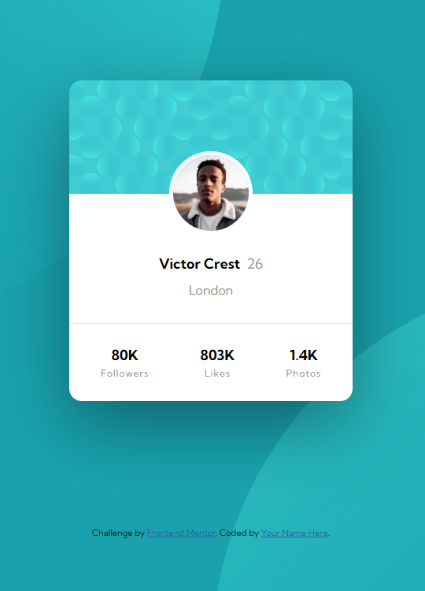

# Frontend Mentor - Profile card component solution

This is a solution to the [Profile card component challenge on Frontend Mentor](https://www.frontendmentor.io/challenges/profile-card-component-cfArpWshJ). Frontend Mentor challenges help you improve your coding skills by building realistic projects. 

## Table of contents

- [Overview](#overview)
  - [The challenge](#the-challenge)
  - [Screenshot](#screenshot)
  - [Links](#links)
- [My process](#my-process)
  - [Built with](#built-with)
  - [What I learned](#what-i-learned)
- [Author](#author)

## Overview

### The challenge

- Build out the project to the designs provided

### Screenshot

### Links

- Solution URL: [https://github.com/vgallop/FeM_ProfileCard](https://github.com/vgallop/FeM_ProfileCard)
- Live Site URL: [https://vgallop.github.io/FeM_ProfileCard/](https://vgallop.github.io/FeM_ProfileCard/)

## My process

### Built with

- HTML5 markup
- CSS custom properties
- Flexbox
- Mobile-first workflow

### What I learned

I learned to use variables in CSS and how to use more than 1 image on the background property.

## Author

- Frontend Mentor - [@vgallop](https://www.frontendmentor.io/profile/vgallop)

